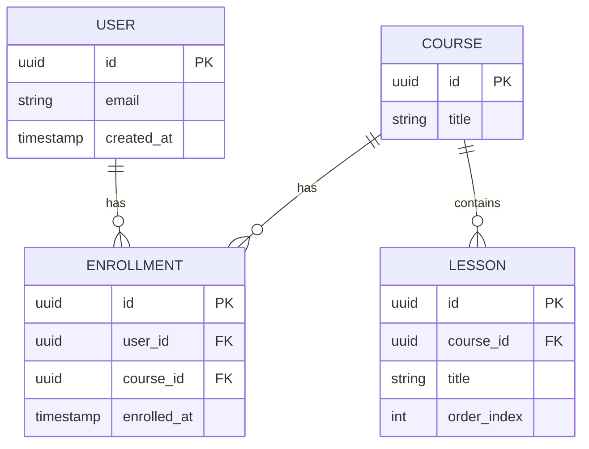
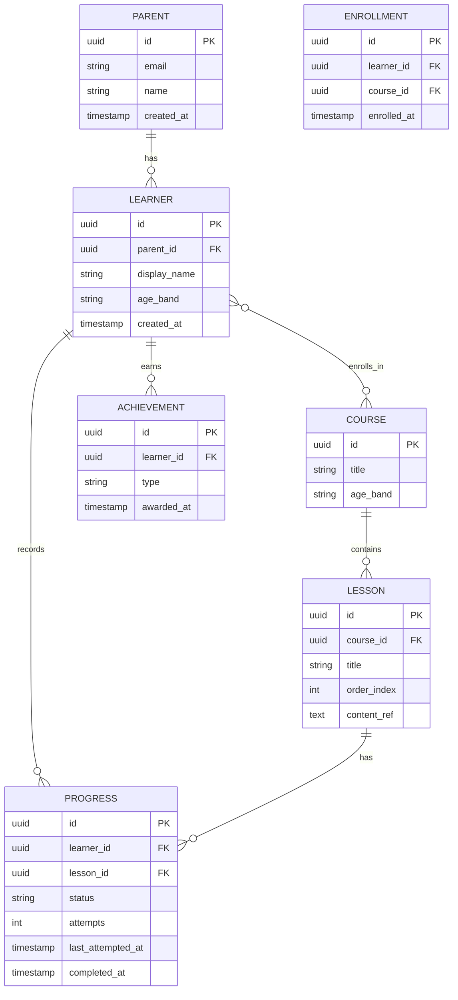

# Data Modeling Basics

**Category**: data_design
**Source**: Wikipedia, Lucidchart
**Use Case**: Architect Agent uses this when designing the data schema in technical specs.

---

## 1. Overview

**Data modeling** is the process of creating a visual representation of data and how it interconnects. The model captures what the system stores, how the pieces relate to one another, and what rules govern those relationships. A well-designed data model is one of the most durable artifacts in a software system: applications get rewritten, frameworks change, infrastructure migrates between clouds, but the entities and relationships in the data model often remain stable for the lifetime of the product. Getting the model right early pays off for years; getting it wrong produces costly migrations and recurring inconsistency bugs.

Data modeling sits at the intersection of three concerns: **the domain** (what real-world things the system represents), **the queries** (how the data will be accessed and updated), and **the storage technology** (relational database, document store, graph database, analytics warehouse). A model that fits the domain but ignores the query patterns produces slow queries; a model that optimizes for queries but ignores the domain produces tangled, hard-to-evolve schemas; a model that ignores storage technology may be elegant in the abstract but unrealistic in practice.

This document covers the three levels at which data is modeled, the Entity-Relationship (ER) approach that underlies most relational design, the normalization theory that produces clean transactional schemas, the denormalization trade-offs that arise in practice, the embed-vs-reference decisions that dominate NoSQL document modeling, and a worked example for an educational coding app. It closes with the most common pitfalls in data-modeling practice.

---

## 2. Three Levels of Data Modeling

Data modeling is conventionally performed at three progressively more concrete levels. Each level serves a different audience and answers different questions.

**Conceptual model.** The highest-level view. The conceptual model identifies the core entities of the domain (Users, Courses, Lessons, Progress) and the high-level relationships between them, without specifying attributes, types, or implementation. Its audience is product, business, and engineering stakeholders who need to align on what the system represents before engineering specifics. A conceptual model fits on a single diagram and uses only nouns the business already understands.

**Logical model.** The detailed structural view. The logical model specifies entities, their attributes, types, primary keys, foreign keys, and relationships—but in a database-agnostic way. It would be implementable on any relational database; it does not yet commit to PostgreSQL, MySQL, or any specific technology. The logical model is the central artifact of data design and is the level at which normalization theory most directly applies.

**Physical model.** The implementation view. The physical model is the logical model translated into the specific syntax, types, indexes, partitioning, and storage decisions of the chosen database. PostgreSQL-specific decisions (JSONB columns, partial indexes, table partitioning), index design, and performance tuning all live here. The physical model is what is actually deployed.

The three levels are not necessarily produced as separate artifacts. Many teams maintain a logical model in a tool like Lucidchart or dbdiagram.io and produce the physical model directly from migration files, with the conceptual model living implicitly in product documentation. The discipline that matters is **separation of concerns**: domain decisions (conceptual), structural decisions (logical), and implementation decisions (physical) should not be conflated.

---

## 3. Entity-Relationship Modeling

Entity-Relationship (ER) modeling is the dominant approach for designing relational schemas. It uses three primitives:

- **Entity**: a thing of interest in the domain. Users, Courses, Lessons, Orders, Products. Entities typically map to tables in the relational implementation.
- **Attribute**: a property of an entity. A User has an email, a name, a creation date. Attributes typically map to columns.
- **Relationship**: a meaningful association between entities. A User *enrolls in* a Course; a Course *contains* Lessons; a Lesson *has* Progress records.

Relationships have **cardinality**, which captures how many instances of one entity can relate to how many of another:

- **One-to-one (1:1)**: each User has exactly one Profile, and each Profile belongs to exactly one User.
- **One-to-many (1:N)**: each Course contains many Lessons, but each Lesson belongs to exactly one Course.
- **Many-to-many (M:N)**: a User can enroll in many Courses, and a Course can have many enrolled Users. Many-to-many relationships in relational databases are typically implemented through a **junction table** (e.g., `enrollments` linking `users` and `courses`).

A simple ER diagram in Mermaid syntax:

Two ER notations dominate practice: **crow's-foot notation** (used in tools like Lucidchart and dbdiagram.io) and **Chen notation** (more academic). Both express the same concepts; crow's-foot is more common in modern engineering practice.

---

## 4. Normalization (1NF to BCNF)

**Normalization** is a set of rules, originally formulated by Edgar Codd in the 1970s, for organizing relational data to eliminate redundancy and prevent update anomalies. The rules are expressed as **normal forms**, each of which builds on the previous.

**First Normal Form (1NF).** All values are atomic (indivisible), and there are no repeating groups. A column that stores a comma-separated list of tags violates 1NF; the tags should be in a separate table. A row should describe one thing.

**Second Normal Form (2NF).** Already in 1NF, plus no partial dependencies on a composite primary key. If a table has a composite key `(order_id, product_id)`, every non-key column must depend on the full key, not on just one part. If a column depends only on `order_id` (e.g., the order's date), it belongs in a separate `orders` table.

**Third Normal Form (3NF).** Already in 2NF, plus no transitive dependencies—non-key columns must not depend on other non-key columns. If a table has a `user_id` and a `user_email` (where email is a function of `user_id`), the email belongs in the `users` table, not duplicated in every row that references the user.

**Boyce-Codd Normal Form (BCNF).** A stricter version of 3NF that handles certain edge cases involving overlapping candidate keys. In practice, schemas that satisfy 3NF nearly always satisfy BCNF, and the distinction matters mostly for pathological cases.

The cumulative effect of normalization is that **each piece of information lives in exactly one place**. Update a user's email once, and every part of the system that needs to display that email reads it from the same source. The redundancy that produces update anomalies—where the same fact lives in multiple rows and updates can leave them inconsistent—is eliminated.

The practical guidance: **aim for 3NF as the default, then deliberately denormalize for performance where measurement justifies it**. 3NF produces clean, evolvable, integrity-preserving schemas. Higher normal forms (4NF, 5NF) address increasingly esoteric cases and are rarely worth the complexity in production systems.

---

## 5. When to Denormalize

Normalization optimizes for write integrity at the cost of read performance: queries that span normalized tables require joins, which have non-trivial cost at scale. **Denormalization** deliberately introduces redundancy to make reads faster, accepting the cost of more complex writes.

Common denormalization patterns:

- **Pre-computed aggregates.** Storing `total_lessons_completed` on a `learner` row, updated when a lesson is completed, rather than recomputing it on every dashboard view.
- **Embedded foreign data.** Storing a learner's `parent_email` directly on the `learner` row, in addition to the canonical copy in the `users` table, to avoid a join when displaying learner records.
- **Wide tables for read-heavy workloads.** Combining what a normalized design would split across multiple tables into one wide table that matches the dominant query shape.

The trade-offs:

- **Pro**: query speed, simpler reads, sometimes simpler indexing.
- **Con**: data redundancy, update anomalies (what happens when the parent's email changes and the duplicated copy is not updated?), more complex write logic.

A useful discipline: **denormalize only when measurement shows it is necessary**. Premature denormalization produces schemas that look fast but are bug-prone and hard to evolve. Deferred denormalization, applied to specific hot paths, captures the performance benefit without surrendering the integrity benefits everywhere else.

A specific case: **analytics workloads** routinely use denormalized schemas (star schema, snowflake schema) because the access patterns and update patterns differ fundamentally from transactional workloads. The star schema, with a central fact table referencing dimension tables, is the canonical pattern for OLAP and data warehousing. This is denormalization as design choice, not as compromise.

---

## 6. NoSQL Modeling: Embed vs Reference

In document databases like MongoDB, the central design question shifts from "how do I normalize?" to "do I embed or reference?" Both options have specific trade-offs.

**Embed when:**
- The related data is **tightly coupled** and is always accessed together. A blog post and its comments, an order and its line items.
- The embedded data is bounded in size. Embedding an unbounded list (e.g., all activity events for a user) eventually produces documents too large to handle efficiently.
- The data does not need to be queried independently of its parent. If you never need "find all comments matching X" across all posts, comments can live inside posts.
- Denormalization is acceptable for the use case—updates to embedded data live in only one place (the parent document) and consistency is local.

**Reference when:**
- The relationship is **many-to-many**. A user can attend many courses, a course has many users; embedding either way duplicates substantial data.
- The related data is shared across many parents and updates need to propagate. Embedding a copy in each parent forces every parent to be updated.
- The related data is unbounded or large.
- The related data needs to be queried independently of any parent.

A common hybrid: **embed for read speed, reference for shared canonical data.** A user's recent activity might be embedded for fast dashboard reads; the user's master profile lives in a separate document and is referenced when needed.

The principle that unifies normalization and embed-vs-reference is the same: **store data once when sharing it matters, duplicate it when query speed and access locality matter more.** The technologies differ, but the underlying trade-off is identical.

---

## 7. Example: Educational Coding App for Kids

Consider the data model for **CodeCub**, a Python-based educational coding app for children aged 6–12. The system tracks parents, children (learners), courses, lessons, learner progress, and achievements.

The conceptual entities and their relationships:

- A **Parent** has one or more **Learners** (their children).
- A **Course** contains many **Lessons** in a defined order.
- A **Learner** enrolls in many **Courses**; each **Course** has many enrolled **Learners**.
- A **Learner** has **Progress** records, one per attempted Lesson.
- A **Learner** has **Achievements** awarded for milestones.

A logical ER diagram in Mermaid:

Notes on this design:

- **Parent and Learner are separate entities** because the buyer (parent) and the user (child) are different people with different access patterns and different data needs. Treating them as one would conflate two distinct roles.
- **Enrollment is a junction table** between Learner and Course, resolving the many-to-many relationship cleanly. It can also carry enrollment-specific data (enrollment date, source channel).
- **Progress is keyed on (learner_id, lesson_id)** with a uniqueness constraint, so each learner has at most one Progress row per lesson. Attempts and last-attempted timestamp accumulate on this row.
- **Achievement is a separate table** rather than columns on Learner. New achievement types can be added without schema changes, and the row-based model supports an unbounded number of achievements per learner.

The schema is **3NF**: every non-key column depends on its full primary key and not on other non-key columns. Each fact (a parent's email, a course's title, a lesson's content reference, a learner's progress on a specific lesson) lives in exactly one place.

**Considered denormalizations** (deferred unless measurement justifies them):

- A `lessons_completed_count` column on Learner, maintained by a trigger or application code, to avoid a count(*) on Progress for every dashboard view.
- A `parent_email` cached on the Learner row to avoid a join when displaying learner cards in administrative views.

These are not implemented up front. They are tracked as candidates and added if production measurement shows the underlying queries are hot enough to justify the maintenance burden.

**For the AI tutoring conversation log** (mentioned in adjacent documents), the data is semi-structured and high-volume. A reasonable design is to keep a small `conversation` row in PostgreSQL referencing the learner and lesson, with the full conversation transcript stored either as JSONB on that row or in a separate document store. This combines the relational integrity of the core schema with the flexibility of document storage for the variable-shape transcript data.

---

## 8. Common Pitfalls

- **Over-normalization in transactional systems.** Pushing normalization beyond 3NF (or even strictly to 3NF when 2NF would do) can produce schemas with so many joins that simple queries become expensive. Apply normalization with judgment, not as a rule.
- **Under-normalization causing update anomalies.** The opposite mistake: duplicating data across rows without explicit reason produces inconsistencies when one copy is updated and another is missed. The "user's email is wrong on this screen but right on that one" bug almost always traces to under-normalization.
- **Missing indexes on foreign keys.** Foreign keys participate in joins; un-indexed foreign keys produce slow joins. Most relational databases do not automatically index foreign keys; the schema designer must do so explicitly.
- **Naming inconsistencies.** Mixing `camelCase` and `snake_case` column names, or singular vs. plural table names, produces friction in every query. Pick one convention (modern Postgres practice is `snake_case` for both columns and tables, plural table names) and apply it consistently.
- **Ignoring the query patterns.** A normalized schema designed without reference to how the data will be queried can be technically correct and operationally painful. Review the dominant query shapes before finalizing the schema.
- **Conflating entity and process.** "Order placement" is a process, not an entity; the entity is the resulting Order. Confusing the two produces tables that try to model both state and history without clear boundaries.
- **Soft-deletes without indexed `deleted_at` columns.** Adding `deleted_at` for soft-delete semantics is fine, but without indexing it (or filtering on it consistently), queries silently include deleted rows or pay the cost of full-table scans.
- **Designing for premature scale.** Sharding strategies, partitioning, and exotic data structures introduced before the data justifies them produce complexity that the team carries for years. A clean 3NF schema in PostgreSQL handles more scale than most teams expect.

---

## 9. References

- Wikipedia — Data modeling: https://en.wikipedia.org/wiki/Data_modeling
- Lucidchart — Database design: https://www.lucidchart.com/pages/database-diagram/database-design