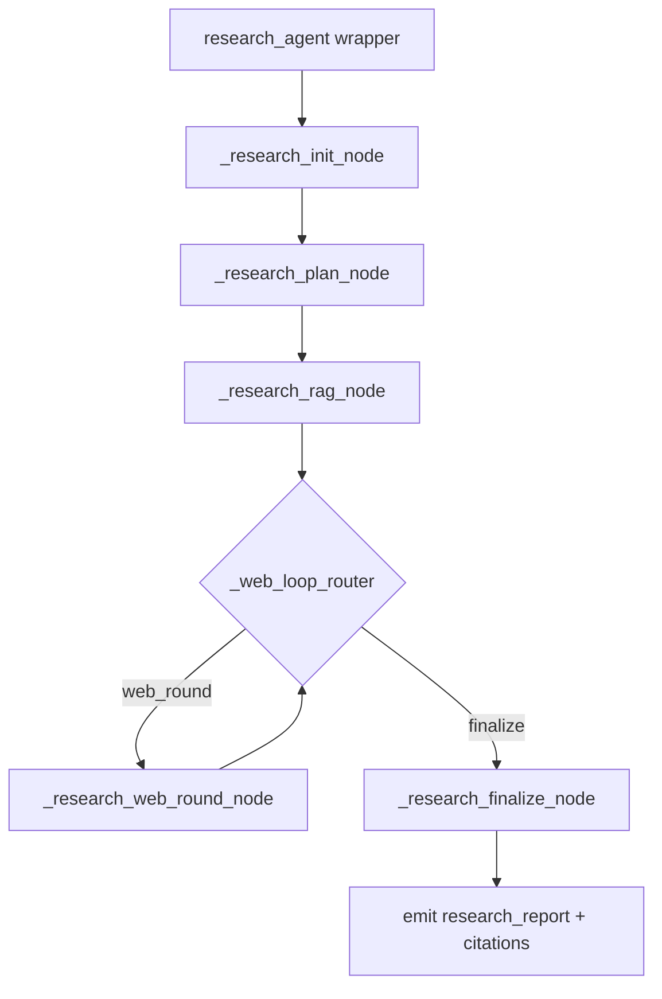

# Research Agent README

This document describes the **current implementation** of `research_agent` in `backend/agents/research.py`, including pipeline flow, APIs, decision logic, and output contracts.

## Architecture

- `research_agent(state)` is now a **wrapper** that invokes a LangGraph subgraph (`_get_research_subgraph().invoke(...)`).
- Internal execution is split into subgraph nodes:
  - `_research_init_node`
  - `_research_plan_node`
  - `_research_rag_node`
  - `_research_web_round_node` (loop)
  - `_research_finalize_node`
- Loop control is done by `_web_loop_router` with conditional edges (`web_round` vs `finalize`).

## What This Agent Produces

Input:
- `state["project_brief"]` (JSON object)

Output:
- `state["research_report"]` with keys:
  - `brief_summary`
  - `research_plan`
  - `rag_findings`
  - `web_findings`
  - `web_search_status`
  - `goal_status`
  - `research_findings`
  - `unresolved_gaps`
  - `sources_used`
- `state["citations"]` (structured claim-to-source mapping)

## High-level Flow

## Step-by-step Logic

1) Brief validation
- Function: `validate_brief()`
- Purpose: detect missing/vague fields, generate assumptions for continuity.

2) Goal plan and RAG query generation (C)
- Primary path: **LLM call at C** via `generate_plan_and_queries()`:
  - `get_llm().invoke([SystemMessage(PLAN_AND_QUERY_SYSTEM), HumanMessage(payload_json)])`
  - Returns dynamic `research_plan` and `rag_queries` based on current `project_brief`.
- Fallback path:
  - Use `DEFAULT_RESEARCH_GOALS` as reference baseline.
  - Use deterministic `generate_rag_queries()` if LLM output is invalid.

3) Internal retrieval (Milvus-backed)
- Function: `internal_rag_search()`
- Calls: `get_kb().retrieve(query_text, agent="Research", k=4)`
- Data source: `backend/rag/kb.py` (Milvus client + embedding query)
- Access control: `backend/rag/access_control.py` (`Research` -> `business` only)

4) RAG findings construction
- Function: `summarize_rag_results_to_findings()`
- **LLM per raw text**: each retrieved `raw_text` is summarized via
  - `get_llm().invoke([SystemMessage(RAG_FINDING_SUMMARY_SYSTEM), HumanMessage(payload_json)])`
  - if LLM fails/empty output, fallback to raw text truncation.
- Each RAG finding includes:
  - `finding_id`
  - `source_type`, `source_name`, `source_path`
  - `query` (the retrieval query that produced this finding)
  - `related_goal_ids`
  - `finding` (summarized snippet)
  - `raw_text` (original retrieved text for traceability)
  - `confidence`, `limitations`

5) Goal satisfaction evaluation (core quality logic)
- Function: `evaluate_goal_satisfaction()`
- **LLM-driven evaluation**:
  - `get_llm().invoke([SystemMessage(GOAL_EVALUATION_SYSTEM), HumanMessage(payload_json)])`
  - LLM judges `status` (`satisfied` / `partially_satisfied` / `unsatisfied`)
  - LLM writes each `required_evidence_answers.answer` and coverage.
- Deterministic guardrails still apply:
  - validate `evidence_ids` must exist in findings
  - normalize schema/shape and cap list lengths
  - enforce rule: if `status == satisfied`, `missing_information` is empty
  - fallback to heuristic baseline if LLM output is invalid/partial

6) Gap-driven web loop (subgraph `web_round` node)
- Functions:
  - `generate_web_queries_with_llm()`
  - `run_web_research_agent()` (new): search -> result selection -> page fetch -> page summary -> web findings
  - merge findings and re-run `evaluate_goal_satisfaction()`
- Query generation is **LLM-driven**:
  - `get_llm().invoke([SystemMessage(WEB_QUERY_SYSTEM), HumanMessage(payload_json)])`
  - Uses `brief + goal_status + existing findings` to generate targeted web queries.
  - If invalid output, fallback to deterministic `generate_web_queries_from_goal_status()`.
- Web research agent behavior:
  - calls `web_search()` (SERP)
  - uses LLM to decide whether to open each result (`web_open_decision`)
  - fetches readable page text via `fetch_webpage_text()`
  - uses LLM to summarize page text into `WEB_F*` finding (`web_page_summary`)
  - accumulates `web_search_status.failure_reasons` for observability
- Trigger: only when unsatisfied/partially_satisfied goals exist.
- Iteration: bounded by `max_web_search_rounds`.
- After each round: merge findings and re-evaluate goals.

7) Final gap/source consolidation (K)
- Build `unresolved_gaps` from non-satisfied goals.
- Build `sources_used` from `rag_findings` and `web_findings`.
- No LLM call in this step.

8) Synthesis and normalization (L/M)
- **LLM call at L**: `get_llm().invoke([SystemMessage(FINAL_SYSTEM), HumanMessage(payload_json)])`
- Parse: `extract_json()`
- Post-process: `_normalize_report_schema()` enforces:
  - stable schema
  - valid `evidence_ids`
  - `raw_text` presence in RAG findings
  - `required_evidence_answers` presence/shape
  - `status`/`missing_information` consistency
  - non-degenerate `research_findings`

9) Citation generation (N/O)
- Built from `goal_status.required_evidence_answers`
- Each citation contains:
  - `goal_id`
  - `required_evidence`
  - `claim`
  - `source_ids`

## LLM Call Annotations (inside subgraph nodes)

- `_research_plan_node`: **LLM call** via `generate_plan_and_queries()` for dynamic goal/query generation.
- `_research_rag_node` (inside `summarize_rag_results_to_findings`): **LLM call per raw_text** to generate each `finding`.
- `_research_rag_node` and `_research_web_round_node` (inside `evaluate_goal_satisfaction`): **LLM call** to judge goal `status` and produce `required_evidence_answers.answer`.
- `_research_web_round_node` (inside `generate_web_queries_with_llm`): **LLM call** to generate web queries from unresolved gaps.
- `_research_finalize_node`: **LLM call** via `get_llm().invoke(...)` for final report synthesis.
- Parsing/normalization/citation assembly remains deterministic (no extra LLM call).

## APIs Called

### Internal app APIs
- `POST /api-test/test/run` (module testing entry)
- `GET /api-test/test/default-input` (default test input)

### Internal data/retrieval APIs
- Milvus via `pymilvus.MilvusClient` in `backend/rag/kb.py`

### External web APIs (inside `backend/tools/web_search.py`)
- `https://duckduckgo.com/html/?q=...`
- `https://duckduckgo.com/lite/?q=...`
- `https://r.jina.ai/https://duckduckgo.com/lite/?q=...` (fallback)

### External fetch APIs (inside `backend/tools/web_fetch.py`)
- direct target URL fetch
- `https://r.jina.ai/<target_url>` (readability fallback)

### LLM API
- Gemini through `backend/llm/gemini.py` (`get_llm().invoke`)

## Logs and Artifacts

Generated by `backend/utils/debug_logger.py`:

- Step logs:
  - `.logs/research_steps_<timestamp>.jsonl`
  - `.logs/research_steps_<timestamp>.pretty.json`
- Artifact logs:
  - `.logs/artifacts_<timestamp>.json`
  - `.logs/artifacts_<timestamp>.md`

Useful step events:
- `research_agent_start`
- `llm_call_start` / `llm_call_end` (all `get_llm().invoke(...)` calls)
- `plan_and_queries_ready`
- `internal_rag_results`
- `rag_findings_summarized`
- `goal_status_after_internal_rag`
- `web_round_start`
- `web_search_done`
- `web_research_no_results`
- `web_fetch_failed`
- `goal_status_after_web_round`
- `unresolved_gaps_built`
- `llm_report_ready`

## Notes for PM-readiness

A report is generally PM-ready only if:
- `goal_status` has no logical contradictions
- `required_evidence_answers` is populated with concrete answers
- `citations` is non-empty for key claims
- unresolved gaps are explicit and actionable

